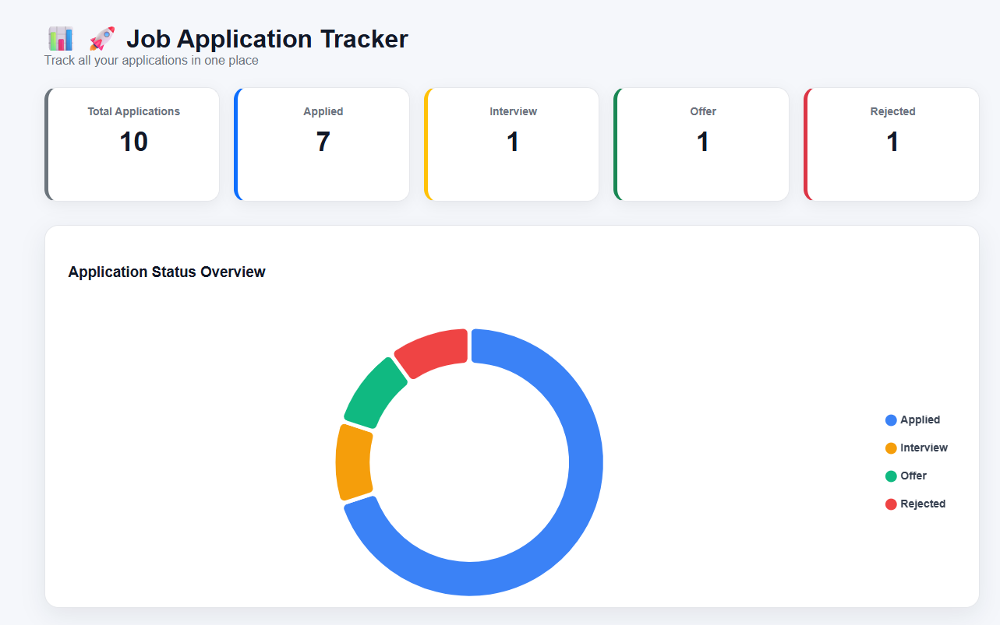
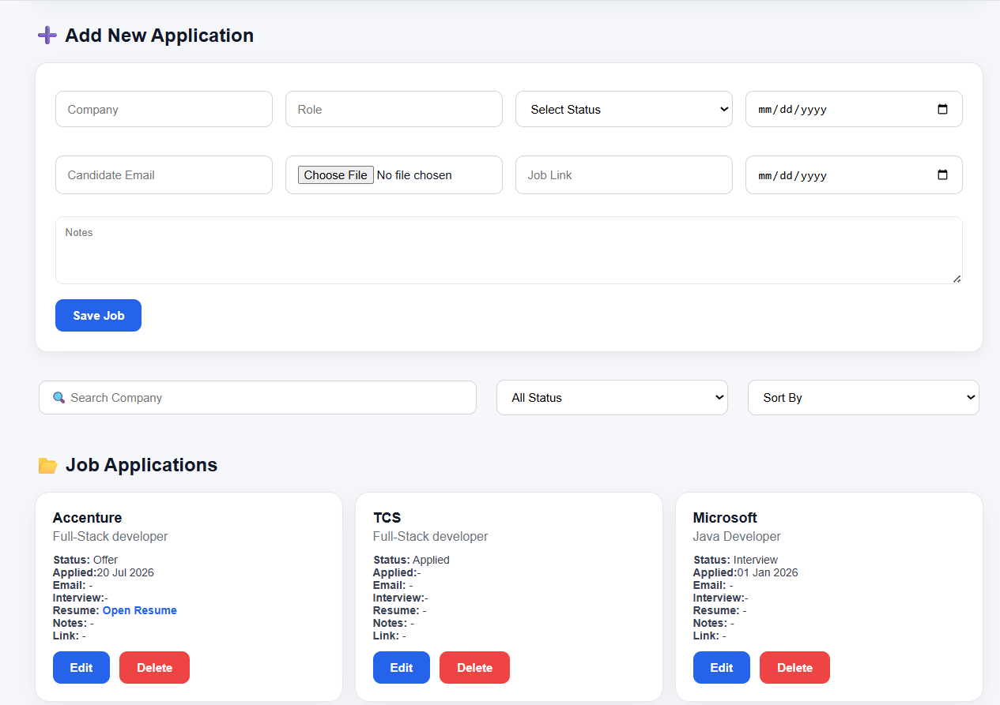
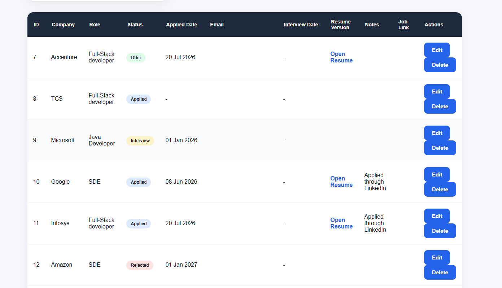

🚀Job Tracker Dashboard

A full-stack Job Application Tracking System built using Spring Boot, Spring Data JPA, MySQL, HTML, CSS, and JavaScript. The application helps users organize and monitor job applications through an interactive dashboard with analytics, search, filtering, sorting, and CRUD operations.

Features:
Add new job applications
Update existing applications
Delete job records
Track application status
Applied
Interview
Offer
Rejected
Search applications by company name
Filter jobs by status
Sort applications by
Latest Applied Date
Oldest Applied Date
Company A–Z
Company Z–A
Interactive dashboard with application statistics
Doughnut chart visualization using Chart.js
Responsive job cards and table view
Store resume version for each application
Add personal notes
Save job application links
Track interview dates
Modern dark-themed user interface
Tech Stack
Backend
Java 17
Spring Boot
Spring Data JPA
Hibernate
Maven
Frontend
HTML5
CSS3
JavaScript
Chart.js
Database
MySQL
Tools
IntelliJ IDEA
VS Code
Git
GitHub
Postman

Project Structure

job-tracker-spring-boot/
│
├── src/
│   └──main/
│      ├── java/
│      │   └── com/jobtracker/jobtracker/
│      │       ├── FileUploadController.java
│      │       ├── Job.java
|      |       |── JobController.java
│      │       ├── JobTrackerApplication.java
|      |       ├── repository/
|      |       |           └── JobRepository.java
│      │       └── service/
|      |                ├── InterviewReminderScheduler
|      |                ├── JobService
|      |                ├── JobServiceImpl
|      |                └── SendGridEmailService
|      |        
│      │
│      └── resources/
│          ├── static/
│          │   └── index.html
│          └── application.properties
│   
│   
│── uploads
├── pom.xml
└── README.md

Dashboard Preview

The dashboard provides:

Total Applications
Applied Count
Interview Count
Offer Count
Rejected Count
Interactive Doughnut Chart
Job Cards
Job Table
Search, Filter & Sort
Database Fields

Each job application contains:

Field	Description
Company	Company name
Role	Job role
Status	Current application status
Applied Date	Date of application
Interview Date	Scheduled interview date
Resume Version	Resume used for the application
Notes	Personal notes
Job Link	Original job posting URL
REST API Endpoints
Method	Endpoint	Description
GET	/jobs	Get all jobs
GET	/jobs/{id}	Get job by ID
POST	/jobs	Add a new job
PUT	/jobs/{id}	Update a job
DELETE	/jobs/{id}	Delete a job
Getting Started
Clone the Repository
git clone https://github.com/Saiharini28/job-tracker-spring-boot.git
Navigate to the Project
cd job-tracker-spring-boot
Configure MySQL

Create a MySQL database and update application.properties.

Example:

spring.datasource.url=jdbc:mysql://localhost:3306/jobtracker
spring.datasource.username=your_username
spring.datasource.password=your_password

spring.jpa.hibernate.ddl-auto=update
spring.jpa.show-sql=true
Run the Application

Using Maven:

mvn spring-boot:run

or run JobTrackerApplication.java directly from your IDE.

Access the Application

Frontend:

http://localhost:8081/

REST API:

http://localhost:8081/jobs

## 📸 Screenshots

### Dashboard

### Add Job Form

### Job Cards

Future Enhancements
Email interview reminders using Spring Scheduler and JavaMailSender
User authentication with Spring Security
Dashboard analytics with additional charts
Export applications to Excel/PDF
Pagination and advanced filtering
File upload for resumes
Responsive mobile design
Role-based access control
Learning Outcomes

This project demonstrates practical experience with:

RESTful API development
CRUD operations
Spring Boot architecture
Spring Data JPA and Hibernate
MySQL database integration
JavaScript Fetch API
Dynamic DOM manipulation
Dashboard UI design
Data visualization using Chart.js
Git and GitHub version control
Author

Sai Harini

GitHub: https://github.com/Saiharini28

License

This project is licensed under the MIT License.